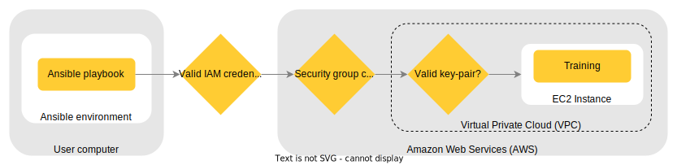

*Copyright (C) 2022, Axis Communications AB, Lund, Sweden. All Rights Reserved.*

# Training on an AWS EC2 Instance using Ansible

Some applications need a trained model to infer a result. We provide examples like [object detection](https://github.com/AxisCommunications/acap-native-sdk-examples/tree/master/object-detection) and [pose estimation](https://github.com/AxisCommunications/acap-computer-vision-sdk-examples/tree/master/pose-estimator-with-flask). In one example in particular, [tensorflow-to-larod-artpec8](https://github.com/AxisCommunications/acap-native-sdk-examples/tree/master/tensorflow-to-larod-artpec8), we show you how to train a model for object detection and how to use it in the camera since training requires a specific environment, not only in software but also in hardware. We provide the tool to train your model in Amazon Web Services (AWS) so that you don't have to build the setup on your own computer. Additionally, we use Ansible, which is an automation framework that in this case automates the deployment of an EC2 instance and all the training.

## Requirements

- Ansible 5 with AWS collection installed ([community.aws](https://docs.ansible.com/ansible/latest/collections/community/aws/index.html))
- AWS account

### Building the environment

Instead of installing Ansible directly on the computer, you can create a virtual environment or run a small Ubuntu Docker container. The Dockerfile only needs a few lines:

```dockerfile
FROM arm64v8/ubuntu:latest
RUN apt-get update && apt-get -y install python3-pip
RUN pip3 install ansible
RUN ansible-galaxy collection install community.aws
RUN pip3 install -r $HOME/.ansible/collections/ansible_collections/amazon/aws/requirements.txt
CMD ["/bin/bash"]
```

1. Pulls the Ubuntu image
2. Installs PIP, a Python package manager
3. Installs Ansible
4. Installs the AWS collection
5. Installs the requirements for the AWS collection
6. Opens the command line

## Structure of this tool

```sh
ansible-training
├── inventory
│   ├── group_vars
│   │   └── vars.yaml
│   └── inventory_aws_ec2.yaml
├── playbooks
│   └── deploy.yaml
├── ansible.cfg
└── README.md
```

- **inventory/group_vars/vars.yaml** - Defines the variables used by the playbook.
- **inventory/inventory_aws_ec2.yaml** - Defines the dynamic inventory used by the playbook.
- **playbooks/deploy.yaml** - The main playbook that deploys the instance and trains.
- **ansible.cfg** - A configuration file for Ansible.

## Quicksteps

If this is the first time you are using AWS or Ansible:

1. Create an IAM user group with *AmazonEC2FullAccess* policies. You can do that in the AWS Console by searching for the *IAM* service, clicking *User groups* in the left pane and then *Create group*.
2. Create an IAM user associated with the IAM user group and download the credentials. You can do that in the AWS Console by searching for the *IAM* service, clicking *Users* in the left pane and then *Add users*. The Ansible playbook expects this user to be named as your computer user `$USER`. It is important that you choose *Access key - Programmatic access* for the credentials type. That way you'll have access through the CLI.
3. At the end of the IAM user creation process, you will be able to copy and download the credentials. Export them in your terminal with the names `AWS_ACCESS_KEY` and `AWS_SECRET_KEY` respectively.
4. Each EC2 instance must be attached to a key-pair, which is your only way of accessing it. To create one, search for *EC2* service in your AWS Console, select *Key Pairs* in the left pane and then *Create key pair*. The Ansible playbook requires using syntax `$USER-key-pair` when naming this key-pair. Select `.pem` pas the file format. 
6. At the end of the key pair creation process, the file will download automatically. You have to copy it to your working directory.
5. Give Ansible permission to use this key by: `chmod 400 $USER-key-pair.pem`.

After that, you will be able to run the playbook:

1. Configure the variables that are located in "inventory/group_vars/vars.yaml", which has to point to the path of the training example. The one you need to change is `EXAMPLE_DIRECTORY`. The rest are optional.
2. Run the playbook:

```sh
ansible-playbook playbooks/deploy.yaml --private-key $USER-key-pair.pem
```

In the diagram below, you can see an explanation of all the security steps needed to connect to an EC2 instance.



## Playbook explanation

There are different steps that are necessary to complete the whole pipeline. The main file in this repository is the Ansible playbook, where all these steps are defined. Each step is called a task.

1. **Get your public IP**
2. **Create security group and allow SSH access**
A security group defines how to access an EC2 Instance. In this case, only SSH from your IP is allowed to access it.
3. **Create the EC2 instance**
The instance is created. Different configurations can be made, like the type of image or instance. To be able to create it, the key pair is used. Also, it's attached to the security group created in the previous step. A tag is also added with your user. This is important because we only want to run the training in the instance we're going to create ourselves.
4. **Add the instance to the inventory**
Once you have the IP address (and DNS name) to connect to the instance, you can add it to the invetory. This allows you to register this IP and use it in the next steps. In "inventory/inventory_aws_ec2.yaml" you can see which instances we are retrieving dynamically: they have to be running, in the specified region and created by you.
5. **Write the new EC2 instance host key to "known_hosts"**
Sometimes, there are problems with connecting the host. For Ansible to be truly automatized, the instance can be added to "known_hosts" so that there are no connection problems.
6. **Train preparation**
Copy the necessary data to the instance to prepare for training.
7. **Build the environment in the instance**
Build an environment with the characteristics you want. Most importantly for this example, the specific Tensorflow version.
8. **Train**
The training and model conversion are done.
9. **Collect model**
Copy the model from the EC2 instance to your local machine to collect the model.
10. **Terminate EC2 instance**
Once you have the model, you can terminate the instance and prevent forgetting about it.
11. **Remove from "known_hosts"**:
To finish, what was done in step 5 is reversed.

Each task has a tag associated to it, which can be useful if you want to only run some tasks. For example, if the training has failed, preventing the execution of the following tasks like terminating the instance, you could run the playbook specifying the tag `cleanup`:

```sh
ansible-playbook playbooks/deploy.yaml --private-key $USER-key-pair.pem --tags cleanup
```

### Variable configuration

We previously mentioned that in "inventory/group_vars/vars.yaml", some variables are defined. Initially, you only need to change the `EXAMPLE_DIRECTORY` to point to your `tensorflow-to-larod-artpec8` training example. However, there are more variables you can change:

- Training example: you will have to change `EXAMPLE_DIRECTORY` in "inventory/group_vars/vars.yaml", but also some tasks of the Ansible playbook (mainly from 6th to 9th).
- Region: you will have to change `aws_region` in "inventory/group_vars/vars.yaml" and `regions` in "inventory/inventory_aws_ec2.yaml".
- Instance type (hardware capabilities of instance): you will have to change `instance_type` in "inventory/group_vars/vars.yaml". To find more instance types, refer to [Amazon EC2 Instance Types](https://aws.amazon.com/ec2/instance-types/?trk=4b76a70e-625f-48c4-b90e-cc5a1eadff15&sc_channel=ps&sc_campaign=acquisition&sc_medium=ACQ-P%7CPS-GO%7CBrand%7CDesktop%7CSU%7CCompute%7CEC2%7CND%7CEN%7CText%7CEU&s_kwcid=AL!4422!3!536323179528!e!!g!!amazon%20ec2%20instance%20types&ef_id=Cj0KCQjwg_iTBhDrARIsAD3Ib5j_-NBHj82QOZoGDnI2pI9-waNVacN1pBBBAkRV9SZ-96om0N-7E6AaAm4IEALw_wcB:G:s&s_kwcid=AL!4422!3!536323179528!e!!g!!amazon%20ec2%20instance%20types). Note that not all instance types are available in all regions.
- Image ID (base software in instance): you will have to change `image_id` in "inventory/group_vars/vars.yaml". To find more images, also called AMI, refer to [Find a Linux AMI](https://docs.aws.amazon.com/AWSEC2/latest/UserGuide/finding-an-ami.html).

### Network configuration

The EC2 instance is created in what Amazon calls a Virtual Private Cloud (VPC). In this notebook, we're using the default VPC that AWS provides. To build your own VPC:

1. Create VPC (main Ansible module: [ec2_vpc_net](https://docs.ansible.com/ansible/latest/collections/amazon/aws/ec2_vpc_net_module.html))
2. Create Internet Gate to define access to or from the EC2 instance (main Ansible module: [ec2_vpc_igw](https://docs.ansible.com/ansible/latest/collections/community/aws/ec2_vpc_igw_module.html))
3. Create subnet to allocate IP for instance (main Ansible module: [ec2_vpc_subnet](https://docs.ansible.com/ansible/latest/collections/amazon/aws/ec2_vpc_subnet_module.html))
4. Give public access to the subnet (main Ansible module: [ec2_vpc_route_table](https://docs.ansible.com/ansible/latest/collections/amazon/aws/ec2_vpc_route_table_module.html))

## License

[Apache 2.0](../LICENSE)

## References

- [https://docs.ansible.com/ansible](https://docs.ansible.com/ansible)
- [https://docs.aws.amazon.com](https://docs.aws.amazon.com)
