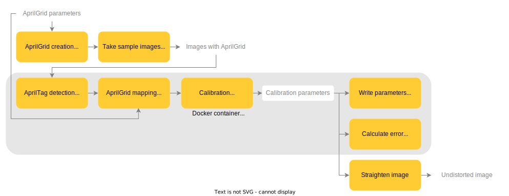

*Copyright (C) 2022, Axis Communications AB, Lund, Sweden. All Rights Reserved.*

# Camera calibration

Images captured by an Axis camera are sometimes visibly distorted in the edges. That is because Axis cameras prioritize capturing a wide area over producing rectilinear images. Distortion can make it difficult to detect objects or to measure distances. To correct this, we can calibrate the image and straighten it.

This README file explains how to get calibration parameters from an Axis camera using a dataset of images captured by the same camera and Apriltag detection library from [ETH-Z](https://github.com/ethz-asl/ethzasl_apriltag2).

We'll go through the steps, starting with making a dataset with the Axis camera and finally calibrating it. To find out more about the process, visit our [documentation](https://axiscommunications.github.io/acap-documentation/docs/develop/camera-calibration.html).



## Requirements

- [Docker](https://docs.docker.com/get-docker/) version 20.10.14 or higher

## Structure of this tool

Below is the structure and scripts used in the tool:

```sh
camera-calibration
├── data
│   ├── aprilgrid_tele
│   └── aprilgird_wide
├── include
│    ├── AprilGrid.hpp
│    ├── calibration.hpp
│    └── writeconfig.hpp
├── src
│    ├── AprilGrid.cpp
│    ├── calibration.cpp
│    └── writeconfig.cpp
├── CMakelists.txt
├── CMakelists-detection.txt
├── Dockerfile
├── main.cpp
└── README.md
```

- **data/aprilgrid_tele** - Dataset consisting of AprilGrid images captured in Tele mode using an Axis camera.
- **data/aprilgrid_wide** - Dataset consisting of AprilGrid images captured in Wide mode using an Axis camera.
- **src/AprilGrid.cpp** - Defines two functions to compute object and image points.
- **src/calibration.cpp** - Collects each image from the captured dataset, detects tags, and computes calibration parameters.
- **Dockerfile** - Dockerfile that builds the image that runs the whole calibration procedure explained below.
- **main.cpp** - Use this file to update/replace the AprilTag grid parameters such as `rows`, `columns`, `grid_size`, `grid_spacing`, and path to the image folder.

## Quicksteps

1. [Create](https://github.com/ethz-asl/kalibr/wiki/calibration-targets#a-aprilgrid) and print an AprilTag grid.
2. Take sample pictures with the Axis camera pointing towards the AprilTag grid, including different positions and orientations of the grid.
3. Write the parameters used to create the pattern and then modify the image folder in [`main.cpp`](main.cpp).
4. Build the Docker image that will download and compile all the calibration code.

    ```sh
    docker build -t <APP_IMAGE> .
    ```

    where `<APP_IMAGE>` is the desired name of the Docker image, for example *calibration*

5. Run the Docker image. The calibration code automatically runs to obtain the estimated calibration parameters saved in `config.cfg`.

    ```sh
    docker run -it --name <APP_CONTAINER> <APP_IMAGE>
    ```

    where `<APP_CONTAINER>` is the desired name of the Docker container, for example *calibration-container*

    Depending on where you run the container, you might get a warning regarding the image's platform not matching the host platform. This is because in we are using [acap-computer-vision-sdk](https://github.com/AxisCommunications/acap-computer-vision-sdk), which contains libraries that have been compiled in different platforms.

6. Copy the calibration parameters.

    ```sh
    docker cp <APP_CONTAINER>:/app/config.cfg .
    ```

### Validation results

Some validation tests were performed with an Axis Q1656 with the following AprilGrid parameters:

- Tele capturing (full zoom):

   ```cpp
   grid_size = 0.024;
   grid_spacing = 0.696/2.4;
   grid_images_path = "../data/aprilgrid_tele";
   rows = 6;
   columns = 6;
   ```

- Wide capturing (no zoom):

   ```cpp
   grid_size = 0.024;
   grid_spacing = 0.696/2.4;
   grid_images_path = "../data/aprilgrid_wide";
   rows = 6;
   columns = 6;
   ```

In the table below, the overall Root Mean Square (RMS) re-projection error in pixels is reported. The images were captured with the default optics configuration and using autofocus before the first picture, so that the camera is focused on the grid. The images that were used to get these results are in the [data](data) folder.

| Camera | Wide capturing (No zoom) | Tele (Full zoom) |
| :- | :- | :- |
| Q1656 | 0.9 | 1.1 |

## License

[Apache 2.0](../LICENSE)

## References

- [https://github.com/ethz-asl/ethzasl_apriltag2](https://github.com/ethz-asl/ethzasl_apriltag2)
- [https://docs.opencv.org](https://docs.opencv.org)
